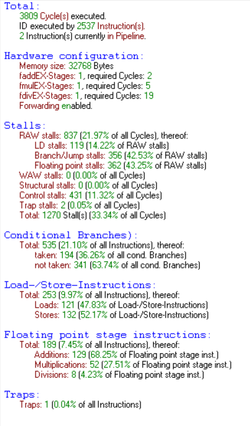

# Práctica DLX Conjetura de Collatz

Óscar Hernández Hernández

Jon García González

---

Implementación de la Conjetura de Collatz. Trás calcular la conjetura dado un valor inicial, realizar unos calculos sobre datos de la secuencia.

$$
secuencia[0]=valor\_inicial
$$

$$
secuencia[n]=\Bigg\{\begin{align*}
\frac{secuencia[n-1]}{2} \quad\text{, si}\quad secuencia[n] \quad\text{es par}\\
secuencia[n-1]x3+1 \quad\text{, si}\quad secuencia[n] \quad\text{es impar}
\end{align*}
$$

### Configuración Usada


Esto quiere decir que tenemos en total 3 unidades de procesos en coma flotante, 1 de addición, otro de multiplicación y otro de división, que requieren 2,5 y 19 ciclos respectivamente. También nos informa que tenemos el mecanismo de adelantamiento activado (*forwarding*).

### Implementación no optimizada

*Todos los cálculos están sacados con el valor_inicial = 97.*

Se realizó una primera implementación partiendo del código visto en clase. Este codigo calculaba y mostraba por pantalla la conjetura de collatz. 

Lo primero que quisimos implementar a el código base fue el guardado en memoria de la secuencia. Para ello movemos y convertimos el valor del registro donde estamos calculando la conjetura a float cada vez que calculamos un nuevo elemento de la secuencia.

```nasm
main:
    lw r4,valor_inicial

    movi2fp f1, r4
    cvti2f f1,f1

    addi r1,r0,secuencia
    sf 0(r1),f1
    addi r1,r1, #4

    addi r2,r0,1
    addi r3,r0,3
```

En la rutina main podemos ver claramente como lo realizamos. Una vez guardado el valor en memoria movemos *r1* a la siguiente dirección de memoria.

```nasm
loop:
    subi r8,r4,1
    beqz r8,jump

    addi r2,r2,1

    andi r9,r4,1
    beqz r9,par
    ;impar
    mult r10,r4,r3
    addi r10,r10,1 
    add r4,r10,r0

    movi2fp f1,r4
    cvti2f f1,f1

    sf 0(r1),f1 
    addi r1,r1,#4

    j loop
```

Nos mantendremos en el loop hasta que *r8* sea igual a 0, el cual es comprobado al principio de cada loop con la instrucción beqz.
Aqui se puede observar un problema que consumirá muchos ciclos, la multiplicación hace que estemos 4 ciclos esperando a que acabe para poder usar su resultado en las siguientes operaciones.
Este problema se solucionará con el [desplazamiento lógico](https://es.wikipedia.org/wiki/Operador_a_nivel_de_bits#Desplazamientos_de_bits).

```nasm
par:
    srli r6,r4,1
    add r4,r6,r0

    movi2fp f1,r4
    cvti2f f1,f1

    sf 0(r1),f1
    addi r1,r1,#4

    j loop
```

De este fragmento lo más importante es como nos hemos ahorrado el coste de la división haciendo un desplazamiento lógico a la derecha.

Revisión de las estadisticas hasta ahora.


Solo con estos fragmentos de código nos encontramos con 2074 ciclos , 172 detenciones por coma flotante, 237 provocadas por un salto o bifurcación, 194 detenciones por control, este dato equivale al numero de saltos efectivos, los cuales ocasionan una detención de un ciclo por cada uno. Siendo el total de Stalls 604.

Como podemos observar en el apartado de Floating point stage instructions, realizamos 43 multiplicaciones.

Seguimos con la implementación de *secuencia_maximo* y *secuencia_valor_medio*. Esto lo hacemos en la rutina llamada jump haciendo uso de las subrutinas *loopmax*, *simayor* y *simenor*.

```nasm
jump:
    movi2fp f2, r2
    cvti2f f2,f2
    sf secuencia_tamanho,f2
    addf f10,f0,f0
    addi r1,r0,secuencia
    lf f4,0(r1)
    lf f11,0(r1)
    addf f10,f10,f4
    addi r1,r1,#4
    subi r2,r2,1
    beqz r2,calculos

    lf f5, 0(r1)
    addf f10,f10,f5
    addi r1,r1,#4

    j loopmax

loopmax:
    subi r2,r2,1
    beqz r2,calculos
    gef f4,f5
    bfpt simayor
    bfpf simenor
    j loopmax

simayor:
    lf f5, 0(r1)
    addf f10,f10,f5
    addi r1,r1,#4
    j loopmax

simenor:
    lf f4,0(r1)
    addf f10,f10,f4
    addi r1,r1,#4
    j loopmax
```

La subrutina *jump* es una subrutina que usamos una vez, aquí lo que realizamos es empezar a cargar los valores de la secuencia en un registro float para hacer la suma de todos ellos para posteriormente poder hacer la media de los valores de la secuencia. Al salir de esta subrutina en *r4* tenemos el primer valor de la secuencia y en *r5* tenemos el segundo valor. En *r2* tenemos *tamaño_secuencia -1*.

Pasamos a *loopmax*, aqui empezamos restando uno a *r2* y comprobando que no sea 0, en caso de que sea 0 hemos recorrido toda la secuencia por lo que pasamos a la subrutina *calculos* donde calcularemos la lista.

Haciendo uso de la instrucción *gef* (*greater equal float*) comprobamos si *f4* es mayor o igual que *f5*, esta instrucción pone 1 en el registro de estado de las operaciones de float (*FP status register*)  si *f4* es mayor o igual a *f5*, y en caso de ser *f5* mayor pone 0.

Las siguientes instrucciones son las que hacen la comprobación de si el *FP status register* está a 0 o 1. Exactamente *bfpt* si es 1 y *bfpf* si es 0.

En las subrutinas *simayor* y *simenor* lo unico que hacemos es cargar en el que no es el mayor el siguiente valor de la secuencia y sumarlo al sumatorio de todos los valores de la secuencia.

Revisión de las estadisticas:


Si comparamos las estadisticas nos encontramos:

Ciclos: 2074 $\rightarrow$ 3566

RAW stalls: 410 $\rightarrow$ 648

- LD stalls: 1 $\rightarrow$ 119

- Branch/Jump stalls: 237 $\rightarrow$ 356

- Floating point stalls: 172 $\rightarrow$ 173

Control stalls: 194 $\rightarrow$ 430

Total: 604 $\rightarrow$ 1078

Como podemos ver está parte del código ocupa en torno a la mitad de los ciclos usados hasta el momento.

Esto se debe a que realizamos muchas detenciones por control y por carga de datos.

Esto será solucionado metiendo estas operaciones en el bucle principal.

Una vez hecho esto pasamos a realizar los calculos de la lista y guardar los valores de *secuencia_maximo* y *secuencia_valor_medio*.

```nasm
calculos:
    sf secuencia_maximo,f5

    divf f12,f10,f2
    sf secuencia_valor_medio,f12

    addi r1,r0,lista

    multf f15,f11,f2
    sf 0(r1),f15
    addi r1,r1,#4

    multf f16,f5,f2
    sf 0(r1),f16
    addi r1,r1,#4

    multf f17,f12,f2
    sf 0(r1),f17
    addi r1,r1,#4

    divf f18,f11,f5
    multf f19,f18,f2
    sf 0(r1),f19
    addi r1,r1,#4

    divf f20,f11,f12
    multf f21,f20,f2
    sf 0(r1),f21
    addi r1,r1,#4

    divf f22,f5,f11
    multf f23,f22,f2
    sf 0(r1),f23
    addi r1,r1,#4

    divf f24,f5,f12
    multf f25,f24,f2
    sf 0(r1),f25
    addi r1,r1,#4

    divf f26,f12,f11
    multf f27,f26,f2
    sf 0(r1),f27
    addi r1,r1,#4

    divf f28,f12,f5
    multf f29,f28,f2
    sf 0(r1),f29
    addi r1,r1,#4


    addi r15,r0,9
    movi2fp f9, r15
    cvti2f f9,f9

    addf f30,f0,f15
    addf f30,f30,f16
    addf f30,f30,f17
    addf f30,f30,f19
    addf f30,f30,f21
    addf f30,f30,f23
    addf f30,f30,f25
    addf f30,f30,f27
    addf f30,f30,f29

    divf f31,f30,f9
    sf lista_valor_medio,f31

    j finish

finish:
        trap 0
```

Aquí unicamente realizamos los cálculos de la lista y los guardamos en memoria.

Ahora revisaremos las estadisticas totales, de las cuales restaremos las que nos habian salido hasta antes de entrar en la subrutina.



Ciclos: 3566 $\rightarrow$ 3809

RAW stalls: 648 $\rightarrow$ 837

- LD stalls: 119 $\rightarrow$ 119

- Branch/Jump stalls: 356 $\rightarrow$ 356

- Floating point stalls: 173 $\rightarrow$ 362

Control stalls: 430 $\rightarrow$ 430

Trap stalls: 0 $\rightarrow$ 2

Total: 1078 $\rightarrow$ 1270

Como podemos observar el numero de ciclos no ha aumentado mucho pero el numero de detenciones por float se ha duplicado. Esto se debe a que en esta parte del código lo unico que hacemos es multiplicar, dividir y sumar para realizar los cálculos de la lista.

### Implementación optimizada

Para esta implementación primero analizamos los problemas que teniamos:

- La multiplicación del loop consume mucho.

- Realizamos las operaciones de valor_maximo y la suma de valores en un bucle aparte pudiendolo meter en el principal.

- La parte de calculos se puede optimizar reduciendo las divisiones.

- Intentar reducir el numero de saltos al comprobar si es par o impar.

##### Multiplicación del loop

Para realizar la multiplicación si $secuencia[n-1]$ es impar, fuimos a lo más básico, $3x=x+x+x=2x+x$. Una vez planteado esto podemos usar el desplazamiento lógico hacia la izquierda para multiplicar por 2 y luego sumarle de nuevo él mismo.

```nasm
    slli r4,r4,1
    add r4,r10,r4
    addi r4,r4,1
```

Si ejecutamos la versión sin optimizar y una versión con solo esta optimización vemos que hemos reducido alrededor de 200 ciclos y 200 detenciones totales. Por lo que podemos concluir que es una buena optimización.

##### Operaciones de valor_maximo y sumavalores

El valor máximo siempre viene precedido por un impar, esto es debido a que el propio problema te dice que si el valor anterior de la secuencia es par debes dividirlo entre 2.

Una vez planteado eso ya solo tienes que copiar el valor de *f1* en f4 siempre que *f1* sea mayor.

La suma de valores de la secuencia es unicamente sumar el valor del valor actual que estemos calculando a la variable.

```nasm
mayor:
    movf f4,f1
loop:
    subi r8,r4,1
    add r13,r13,r4
    beqz r8,calculos

    andi r9,r4,1

    addi r2,r2,1

    beqz r9,par
    ;impar
    slli r10,r4,1
    add r4,r10,r4
    addi r4,r4,1

    movi2fp f1,r4
    cvti2f f1,f1

    sf 0(r1),f1
    addi r1,r1,#4

    gtf f4,f1
    bfpf mayor

    j loop
```

Si comprobamos si la optimización es relevante nos encontramos que de 3566 ciclos hemos pasado a 2049 ciclos y el total de detenciones ha bajado alrededor de dos tercios del mismo, de 1078 a 388. Aqui hemos hecho la gran optimización del programa, casi la mitad de ciclos y dos tercios de las detenciciones del programa.

Esto es debido a que ya no tenemos que volver a recorrer la secuencia sumando y buscando el maximo, con los cálculos y saltos que ello conlleva.

Aqui dejamos una comparativa de las estadisticas de la versión no optimizada y la versión solo con la optimización de calculo de valor_maximo y sumavalores.


Añadiendo las dos optimizaciones vistas hasta ahora los ciclos se reducen a 1878 y el total de detenciones a 196.

##### Calculos de la lista

Aqui se plantea el problema del coste de la división y la multiplicación. La división nos cuesta 19 ciclos frente a los 5 ciclos de la multiplicación.

Este problema se soluciona convirtiendo las divisiones en multiplicaciones y sacando constantes.

$$
Vmed = SumaSecuencia/vT
\\
\text{lista = [ vIni* vT, vMax*vT, vMed*vT,}
\\
\text{(vIni/vMax)*vT, (vIni/vMed)*vT,}
\\
\text{(vMax/vIni)*vT,(vMax/vMed)*vT,}
\\
\text{(vMed/vIni)*vT, (vMed/vMax)*vT ]}
\\
lista\_valor\_medio = SumaValoresLista / 9
$$

Como podemos observar tenemos que hacer 8 divisiones y 9 multiplicaciones.  

$$
vMed = SumaSecuencia/vT
\\ vIni*vT = \alpha \quad vMax*vT = \beta \\ vMed*vT = (SumaSecuencia/vT) * vT = SumaSecuencia = \lambda \ 
\\ 

(vIni/vMax)*vT = vIni*(1/vMax)*vT = \alpha * (1/vMax) \\
(vIni/vMed)*vT = vIni*(1/vMed)*vT = \alpha * (1/vMed) \\
(vMax/vIni)*vT = vMax*(1/vIni)*vT = \beta * (1/vIni) \\
(vMax/vMed)*vT = vMax*(1/vMed)*vT = \beta * (1/vMax) \\
(vMed/vMax)*vT = vMed*(1/vIni)*vT = \lambda * (1/vIni) \\
(vMed/vMax)*vT = vMed*(1/vMax)*vT = \lambda * (1/vMax) \\
lista\_valor\_medio = SumaValores * 0.111111 \rightarrow 1/9=0.\overline1
$$

Una vez hecho esto nos encontramos con que tenemos que realizar 4 divisiones y 9 multiplicaciones. Por lo que hemos realizado la mitad de divisiones. Considerando el coste de las divisiones y el de las multiplicaciones vemos que pese a noser donde más se optimiza conseguimos bajar unos cuantos ciclos.

##### Bucle par impar

Si nos fijamos, si conseguimos dehacer el bucle de alguna forma podriamos optmizar bastante código. Para ello lo que haremos será añadir al bucle principal una iteracción más del loop(duplicamos el cuerpo del bucle) y al par añadir dos veces el bucle. Esto se hace para evitar el salto a loop `j loop`.
El resultado es una optimización de 200 ciclos y 100 Stalls.

### Estadisticas

##### valor_inicial : 97

| Estadisticas             | VersionNoOptimizada | VersionOptimizada |
|:------------------------:|:-------------------:|:-----------------:|
| **Ciclos**               | 3809                | 1751              |
| **Numero Instrucciones** | 2537                | 1610              |

| STALLS                    | VersiónNoOptimizada                | VersiónOptimizada          |
|:-------------------------:|:----------------------------------:|:--------------------------:|
| **RAW Stalls**            | 837 = 21.97% of all Cycles         | 33 = 1.88% of all Cycles   |
| **LD Stalls**             | 119 = 14.22% of RAW Stalls         | 0 = 0.0% of RAW Stalls     |
| **Branch/Jump Stalls**    | 356 = 42.53% of RAW Stalls         | 0 = 0.0% of RAW Stalls     |
| **Floating Point Stalls** | 362 = 43.25% of RAW Stalls         | 33 = 100.00% of RAW Stalls |
| **WAW Stalls**            | 0 = 0.0% of all cycles             | 0 = 0.0% of all cycles     |
| **Structural Stalls**     | 0 = 0.0% of all cycles             | 15 = 0.86% of all cycles   |
| **Control Stalls**        | 431 = 11.32% of all cycles         | 88 = 5.02% of all cycles   |
| **Trap Stalls**           | 2 = 0.05% of all cycles            | 5 = 0.28% of all cycles    |
| **Total**                 | 1270 Stalls = 33.34% of all cycles | 141 = 8.05% of all cycles  |

| Conditional Branches | VersiónNoOptimizada                | VersiónOptimizada                  |
|:--------------------:|:----------------------------------:|:----------------------------------:|
| **Total**            | 535 = 21.10% of all Instructions   | 280 = 17.39% of all Instructions   |
| **Tomados**          | 194 = 36.26% of all cond. Branches | 88 = 31.43% of all cond. Branches  |
| **No tomados**       | 341 = 63.74% of all cond. Branches | 192 = 68.57% of all cond. Branches |

| Instrucciones Load/Store | VersiónNoOptimizada                     | VersiónOptimizada                       |
|:------------------------:|:---------------------------------------:|:---------------------------------------:|
| **Total**                | 253 = 9.97% of all Instructions         | 135 = 8.38% of all Instructions         |
| **Loads**                | 121 = 47.83% of Load/Store-Instructions | 3 = 2.22% of Load/Store-Instructions    |
| **Stores**               | 132 = 97.78% of Load/Store-Instructions | 132 = 97.78% of Load/Store-Instructions |

| Instrucciones de punto flotante | VersiónNoOptimizada                        | VersiónOptimizada                        |
|:-------------------------------:|:------------------------------------------:|:----------------------------------------:|
| **Total**                       | 189 = 7.45% of all Instructions            | 22 = 1.37% of all Instructions           |
| **Sumas**                       | 129 = 68.25% of Floating Point Stage inst. | 9 = 40.91% of Floating Point Stage inst. |
| **Multiplicaciones**            | 52 = 27.51% of Floating Point Stage inst.  | 9 = 40.91% of Floating Point Stage inst. |
| **Divisiones**                  | 8 = 4.23% of Floating Point Stage inst.    | 4 = 18.18% of Floating Point Stage inst. |

| Traps     | VersiónNoOptimizada           | VersiónOptimizada             |
|:---------:|:-----------------------------:|:-----------------------------:|
| **Traps** | 1 = 0.04% of all Instructions | 1 = 0.06% of all Instructions |

##### valor_inicial : 66

| Estadisticas             | VersionNoOptimizada | VersionOptimizada |
| ------------------------ | ------------------- | ----------------- |
| **Ciclos**               | 1084                | 477               |
| **Numero Instrucciones** | 645                 | 402               |

| STALLS                    | VersiónNoOptimizada               | VersiónOptimizada          |
| ------------------------- | --------------------------------- | -------------------------- |
| **RAW Stalls**            | 333 = 30.72% of all Cycles        | 33 = 6.92% of all Cycles   |
| **LD Stalls**             | 28 = 8.41% of RAW Stalls          | 0 = 0.0% of RAW Stalls     |
| **Branch/Jump Stalls**    | 83 = 24.92% of RAW Stalls         | 0 = 0.0% of RAW Stalls     |
| **Floating Point Stalls** | 222 = 66.67% of RAW Stalls        | 33 = 100.00% of RAW Stalls |
| **WAW Stalls**            | 0 = 0.0% of all cycles            | 0 = 0.0% of all cycles     |
| **Structural Stalls**     | 0 = 0.0% of all cycles            | 15 = 3.14% of all cycles   |
| **Control Stalls**        | 102 = 9.41% of all cycles         | 21 = 4.40% of all cycles   |
| **Trap Stalls**           | 2 = 0.18% of all cycles           | 5 = 1.05% of all cycles    |
| **Total**                 | 437 Stalls = 40.31% of all cycles | 74 = 15.51% of all cycles  |

| Conditional Branches | VersiónNoOptimizada               | VersiónOptimizada                 |
| -------------------- | --------------------------------- | --------------------------------- |
| **Total**            | 134 = 20.78% of all Instructions  | 63 = 15.67% of all Instructions   |
| **Tomados**          | 47 = 35.07% of all cond. Branches | 21 = 33.33% of all cond. Branches |
| **No tomados**       | 87 = 64.92% of all cond. Branches | 42 = 66.67% of all cond. Branches |

| Instrucciones Load/Store | VersiónNoOptimizada                    | VersiónOptimizada                      |
| ------------------------ | -------------------------------------- | -------------------------------------- |
| **Total**                | 71 = 9.97% of all Instructions         | 44 = 10.94% of all Instructions        |
| **Loads**                | 30 = 42.25% of Load/Store-Instructions | 3 = 6.82% of Load/Store-Instructions   |
| **Stores**               | 41 = 57.75% of Load/Store-Instructions | 41 = 93.18% of Load/Store-Instructions |

| Instrucciones de punto flotante | VersiónNoOptimizada                       | VersiónOptimizada                        |
| ------------------------------- | ----------------------------------------- | ---------------------------------------- |
| **Total**                       | 63 = 9.77% of all Instructions            | 22 = 5.47% of all Instructions           |
| **Sumas**                       | 38 = 60.32% of Floating Point Stage inst. | 9 = 40.91% of Floating Point Stage inst. |
| **Multiplicaciones**            | 17 = 26.98% of Floating Point Stage inst. | 9 = 40.91% of Floating Point Stage inst. |
| **Divisiones**                  | 8 = 12.70% of Floating Point Stage inst.  | 4 = 18.18% of Floating Point Stage inst. |

| Traps     | VersiónNoOptimizada           | VersiónOptimizada             |
| --------- | ----------------------------- | ----------------------------- |
| **Traps** | 1 = 0.16% of all Instructions | 1 = 0.25% of all Instructions |

##### valor_inicial : 10

| Estadisticas             | VersionNoOptimizada | VersionOptimizada |
| ------------------------ | ------------------- | ----------------- |
| **Ciclos**               | 447                 | 190               |
| **Numero Instrucciones** | 197                 | 129               |

| STALLS                    | VersiónNoOptimizada               | VersiónOptimizada          |
| ------------------------- | --------------------------------- | -------------------------- |
| **RAW Stalls**            | 221 = 49.44% of all Cycles        | 33 = 17.37% of all Cycles  |
| **LD Stalls**             | 7 = 3.17% of RAW Stalls           | 0 = 0.0% of RAW Stalls     |
| **Branch/Jump Stalls**    | 20 = 9.05% of RAW Stalls          | 0 = 0.0% of RAW Stalls     |
| **Floating Point Stalls** | 194 = 87.78% of RAW Stalls        | 33 = 100.00% of RAW Stalls |
| **WAW Stalls**            | 0 = 0.0% of all cycles            | 0 = 0.0% of all cycles     |
| **Structural Stalls**     | 0 = 0.0% of all cycles            | 15 = 7.89% of all cycles   |
| **Control Stalls**        | 25 = 5.59% of all cycles          | 7 = 3.68% of all cycles    |
| **Trap Stalls**           | 2 = 0.45% of all cycles           | 5 = 2.63% of all cycles    |
| **Total**                 | 248 Stalls = 55.48% of all cycles | 60 = 31.58% of all cycles  |

| Conditional Branches | VersiónNoOptimizada               | VersiónOptimizada                |
| -------------------- | --------------------------------- | -------------------------------- |
| **Total**            | 29 = 14.72% of all Instructions   | 14 = 10.85% of all Instructions  |
| **Tomados**          | 12 = 41.38% of all cond. Branches | 7 = 50.00% of all cond. Branches |
| **No tomados**       | 17 = 58.62% of all cond. Branches | 7 = 50.00% of all cond. Branches |

| Instrucciones Load/Store | VersiónNoOptimizada                    | VersiónOptimizada                      |
| ------------------------ | -------------------------------------- | -------------------------------------- |
| **Total**                | 29 = 14.72% of all Instructions        | 23 = 17.83% of all Instructions        |
| **Loads**                | 9 = 31.03% of Load/Store-Instructions  | 3 = 13.04% of Load/Store-Instructions  |
| **Stores**               | 20 = 68.96% of Load/Store-Instructions | 20 = 86.96% of Load/Store-Instructions |

| Instrucciones de punto flotante | VersiónNoOptimizada                       | VersiónOptimizada                        |
| ------------------------------- | ----------------------------------------- | ---------------------------------------- |
| **Total**                       | 35 = 17.77% of all Instructions           | 22 = 17.05% of all Instructions          |
| **Sumas**                       | 17 = 48.57% of Floating Point Stage inst. | 9 = 40.91% of Floating Point Stage inst. |
| **Multiplicaciones**            | 10 = 28.57% of Floating Point Stage inst. | 9 = 40.91% of Floating Point Stage inst. |
| **Divisiones**                  | 8 = 22.86% of Floating Point Stage inst.  | 4 = 18.18% of Floating Point Stage inst. |

| Traps     | VersiónNoOptimizada           | VersiónOptimizada             |
| --------- | ----------------------------- | ----------------------------- |
| **Traps** | 1 = 0.51% of all Instructions | 1 = 0.78% of all Instructions |
